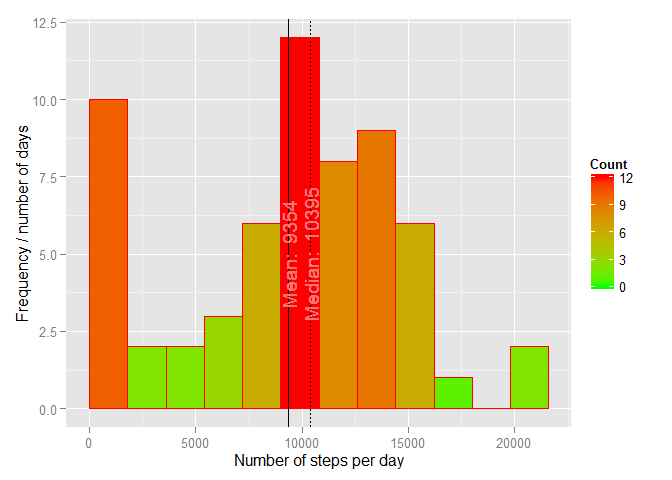
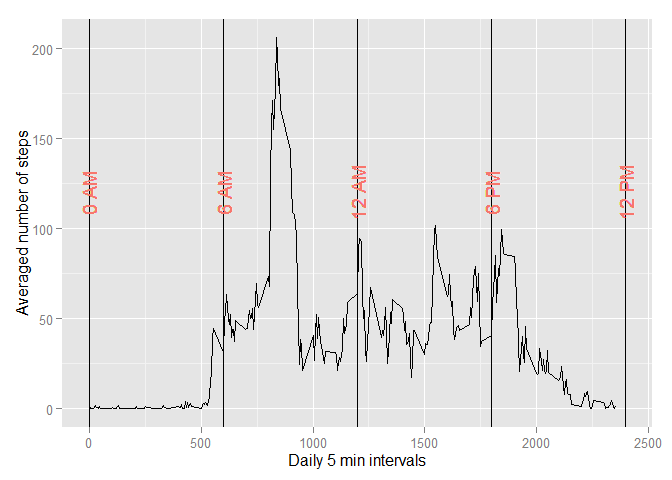
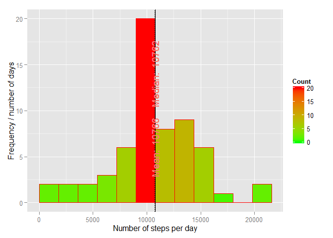
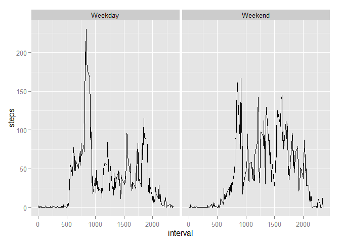

# Reproducible Research: Peer Assessment 1
duxan  
August 16, 2015  


## Loading and preprocessing the data
If source data is there, load it into R:


```r
if (file.exists("activity.zip")){
    if(!file.exists("activity.csv")){
        unzip("activity.zip")
    }
    activity <- read.csv("activity.csv")
} else {
    print("No activity.zip in DIR")
}
```


## What is mean total number of steps taken per day?
Let's first `aggregate` the data by date using sum as FUN:


```r
activity.daily.sum <- aggregate(activity$steps, by = list(activity$date), sum, na.rm=T)
```

Then make histogram with mean and median lines:


```r
library(ggplot2)
```

```
## Warning: package 'ggplot2' was built under R version 3.2.1
```

```r
ggplot(data=activity.daily.sum, aes(activity.daily.sum$x)) + 
    geom_histogram(breaks=seq(0, 22000, by =1800), col="red", aes(fill=..count..)) +
    scale_fill_gradient("Count", low = "green", high = "red") + 
    geom_vline(aes(xintercept = mean(activity.daily.sum$x), linetype="Mean steps")) + 
    geom_vline(aes(xintercept = median(activity.daily.sum$x), linetype="Median steps")) +
    geom_text(aes(x = mean(activity.daily.sum$x), y = 5, label = paste("Mean: ", round(mean(activity.daily.sum$x))), 
                  color = "red"), angle = 90, show_guide = FALSE) + 
    geom_text(aes(x = median(activity.daily.sum$x), y = 5, label = paste("Median: ", round(median(activity.daily.sum$x))), 
                  color = "red"), angle = 90, show_guide = FALSE) + 
    xlab("Number of steps per day") + 
    ylab("Frequency / number of days")
```

 

## What is the average daily activity pattern?
Activity pattern is made when average count of steps in each 5min interval are calculated:


```r
activity.5min.mean <- aggregate(activity$steps, by = list(activity$interval), mean, na.rm=T)
```

Line graph shows the pattern:

```r
ggplot(data=activity.5min.mean, aes(x=activity.5min.mean$Group.1, y=activity.5min.mean$x)) + 
    geom_line() + 
    geom_vline(aes(xintercept=0)) + geom_text(aes(x = 0, y = 120, label = "0 AM", color = "red"), angle = 90, show_guide = F) +
    geom_vline(aes(xintercept=600)) + geom_text(aes(x = 600, y = 120, label = "6 AM", color = "red"), angle = 90, show_guide = F) +
    geom_vline(aes(xintercept=1200)) + geom_text(aes(x = 1200, y = 120, label = "12 AM", color = "red"), angle = 90, show_guide = F) +
    geom_vline(aes(xintercept=1800)) + geom_text(aes(x = 1800, y = 120, label = "6 PM", color = "red"), angle = 90, show_guide = F) +
    geom_vline(aes(xintercept=2400)) + geom_text(aes(x = 2400, y = 120, label = "12 PM", color = "red"), angle = 90, show_guide = F) +
    xlab("Daily 5 min intervals") + 
    ylab("Averaged number of steps")
```

 

Max average number of steps are at 

```r
activity.5min.mean[activity.5min.mean$x == max(activity.5min.mean$x),]
```

```
##     Group.1        x
## 104     835 206.1698
```

which is 8:35 AM.

## Imputing missing values

Number of missing values is 2304 (calculated inline).

For imputing missing values we could use acitivity averaged per interval `activity.5min.mean`:


```r
activity.imputed <- activity
activity.imputed[is.na(activity.imputed$steps),]$steps <- round(activity.5min.mean$x)
```

From histogram below we see that now mean and median are the same!


```r
activity.imputed.daily.sum <- aggregate(activity.imputed$steps, by = list(activity.imputed$date), sum, na.rm=T)
ggplot(data=activity.imputed.daily.sum, aes(activity.imputed.daily.sum$x)) + 
    geom_histogram(breaks=seq(0, 22000, by =1800), col="red", aes(fill=..count..)) +
    scale_fill_gradient("Count", low = "green", high = "red") + 
    geom_vline(aes(xintercept = mean(activity.imputed.daily.sum$x), linetype="Mean steps")) + 
    geom_vline(aes(xintercept = median(activity.imputed.daily.sum$x), linetype="Median steps")) +
    geom_text(aes(x = mean(activity.imputed.daily.sum$x), y = 6, label = paste("Mean: ", round(mean(activity.imputed.daily.sum$x))), 
                  color = "red"), angle = 90, show_guide = FALSE) + 
    geom_text(aes(x = median(activity.imputed.daily.sum$x), y = 14, label = paste("Median: ", round(median(activity.imputed.daily.sum$x))), 
                  color = "red"), angle = 90, show_guide = FALSE) + 
    xlab("Number of steps per day") + 
    ylab("Frequency / number of days")
```

 

## Are there differences in activity patterns between weekdays and weekends?

We introduce factor variable with two levels (weekday or weekend):


```r
activity.imputed$date <- as.Date(activity.imputed$date)
activity.imputed$weekday <- as.factor(ifelse(weekdays(activity.imputed$date) %in% c("Saturday","Sunday"), "Weekend", "Weekday")) 
activity.imputed.5min.mean.by.weekday  <- aggregate(x = activity.imputed$steps, 
    by = list(activity.imputed$interval, activity.imputed$weekday), mean, na.rm=T)
names(activity.imputed.5min.mean.by.weekday) <- c("interval","weekday","steps")
```

Panel plot of the 5min interval and the average number of steps taken averaged across all weekday days or weekend days:


```r
ggplot(activity.imputed.5min.mean.by.weekday, aes(interval, steps)) +
    facet_grid(. ~ weekday) +
    geom_line()
```

 
